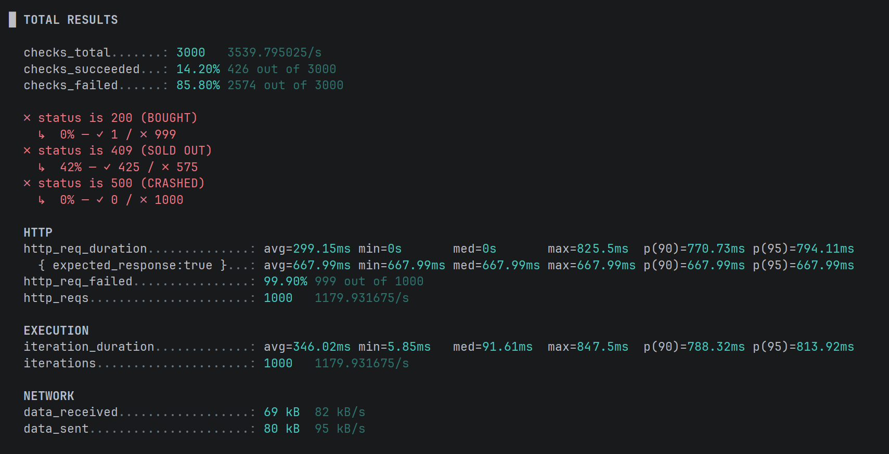

## Pessimistic Locking: The Thundering Herd Problem

### The Challenge

While Optimistic Locking prevents data corruption, it suffers from "Retry Storms" where thousands of transactions are fully processed only to fail at the commit phase. This wastes significant CPU cycles on computation that is destined to be rolled back. We needed a mechanism that enforces strict serialization: First-Come, First-Served.

### The Solution: Pessimistic Locking

We implemented **JPA Pessimistic Locking** using the `PESSIMISTIC_WRITE` mode.

* **Mechanism:** The database issues a `SELECT ... FOR UPDATE` query, placing an exclusive row lock on the target record immediately upon read.
* **Queueing:** Subsequent transactions are halted at the database level until the lock is released or a timeout occurs.
* **Safety Valve:** A `jakarta.persistence.lock.timeout` hint (3000ms) prevents infinite blocking during high contention.

### Performance Testing (k6)

We stress-tested the endpoint with 1,000 concurrent Virtual Users (VUs) on an **AMD Ryzen 7 7700X** (8-core/16-thread).

* **Target:** 1 Ticket Available.
* **Result:** 1 Success (200 OK), 425 Logical Rejections (409 Conflict), 574 Network Bounces.
* **Latency:** * **Average:** ~299ms
* **Max:** ~825ms (Significantly lower than expected due to "Fail Fast" logic skipping the 20ms simulated delay).

### Analysis: The "Double Queue" Bottleneck

The test revealed a two-stage funnel architecture under extreme load:

1. **Tomcat Queue (The Lobby):** Configured for 1,000 threads, successfully accepting traffic until OS-level TCP backlog limits were hit (causing the 574 network bounces).
2. **HikariCP Funnel (The Choke Point):** With a pool size of 50, only 50 threads could compete for the lock at any given time.
* **Outcome:** The remaining 425 threads queued inside the JVM, waiting for a connection. This acted as a natural throttle, preventing the database from being overwhelmed by 1,000 simultaneous lock requests.

### Drawbacks of Pessimistic Locking

* **Database Connection Exhaustion:** Unlike Optimistic locking, waiting threads hold onto a physical database connection while they wait for the lock. In a system with limited connections (e.g., max 50), a single locked row can starve the entire application, preventing other unrelated queries from running.
* **Throughput Cap:** Access to the hot row is strictly serialized. The theoretical maximum throughput is `1 / (Transaction Time)`. If a transaction takes 20ms, the absolute maximum throughput is 50 requests/second, regardless of server hardware.
* **Deadlock Risk:** If multiple resources are locked in different orders (e.g., Thread A locks Row 1 then Row 2, while Thread B locks Row 2 then Row 1), the application can enter a deadlock state, requiring database intervention to kill the connection.
* **Latency Spikes:** For users at the back of the queue, response time is the sum of *all* preceding transactions. In a long queue without timeouts, the last user could face massive delays (e.g., 50 users * 20ms = 1 second wait).