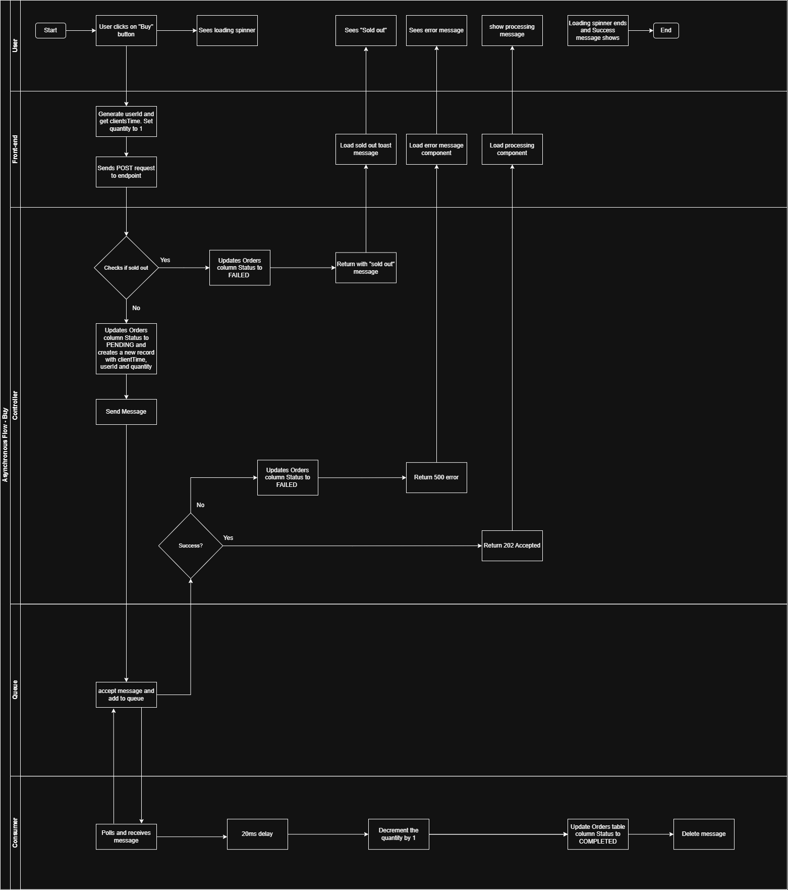

# Phase 4: Asynchronous Processing (AWS SQS)

This branch implements the **Asynchronous Processing** pattern to solve the "Thundering Herd" problem. Instead of blocking the server threads during high-traffic spikes (e.g., ticket sales), we offload requests to an AWS SQS queue for reliable background processing.

## System Architecture

I have sketched a rough system design to visualize the new flow, separating the **Producer** (Controller) from the **Consumer** (Worker).

> **Note:** This diagram is a rough draft included for completeness. It illustrates the decoupling of the HTTP response (`202 Accepted`) from the actual database transaction.

---

## Setup & Configuration

### 1. Dependencies (POM)
We have migrated to **Spring Cloud AWS 3.0+** (modern standard).
- **BOM (Bill of Materials):** added to manage Spring Cloud versions.
- **Dependencies:** Added `spring-cloud-aws-starter-sqs` for robust queue communication.

### 2. AWS Configuration
The `application.properties` file has been updated to connect to the AWS `ap-south-1` (Mumbai) region.