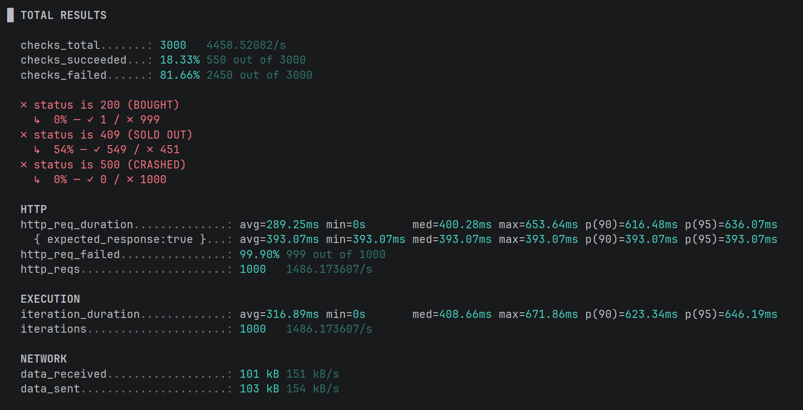

## Optimistic Locking: The Thundering Herd Problem

### The Challenge
During high-traffic events, thousands of users may attempt to purchase the same item simultaneously. A naive implementation leads to "Race Conditions" where more items are sold than exist in inventory.

### The Solution: Optimistic Locking
We implemented **JPA Optimistic Locking** using a `@Version` field.
- **Mechanism:** Every update checks if the version in the DB matches the version in memory.
- **Result:** If two users collide, the first succeeds and increments the version; the second fails with an `ObjectOptimisticLockingFailureException`.

### Performance Testing (k6)
We stress-tested the endpoint with 1,000 concurrent Virtual Users (VUs):
- **Target:** 1 Ticket Available.
- **Result:** 1 Success (200 OK), 549 Logical Rejections, 450 Network Bounces
- **CPU:** Validated on AMD Ryzen 7 7700X (8-core/16-thread).

### Drawbacks of Optimistic Locking

* **Wasted Computation ("Ghost Transactions"):** Since the version check only happens during the `COMMIT` phase, the server fully executes all business logic for every request. In high-contention scenarios, you waste CPU and memory on thousands of threads that are mathematically guaranteed to be rolled back.
* **The External Sync Problem:** If a transaction includes calls to external microservices or third-party APIs, those actions cannot be "undone" by a database rollback. You risk a scenario where an external action completes (e.g., sending a notification or triggering a service), but the local database record fails to update due to a version mismatch.
* **Massive Rollback Overhead:** Under extreme load, the database spends more resources managing the 999 rollbacks and throwing `Conflict` exceptions than it does on the 1 successful commit. This can lead to high database CPU spikes without any productive data throughput.
* **First-to-Finish vs. First-to-Start:** It doesn't matter who clicked "Buy" first; it only matters whose thread reaches the commit phase first. In a high-latency environment, this turns a fair queue into a "network lottery," which may not be ideal for strict FCFS (First-Come, First-Served) business requirements.
