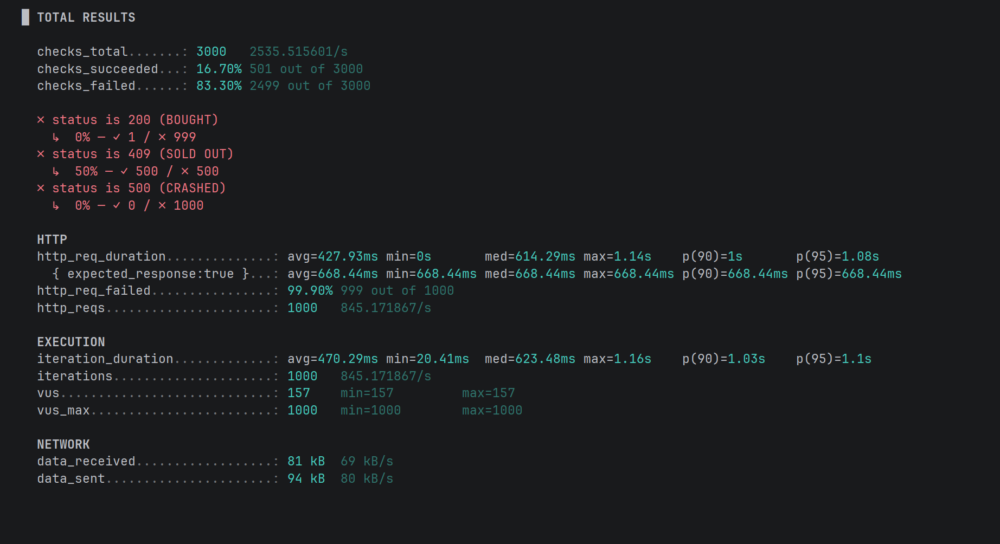

## Phase 3: Atomic Updates (Database-Level Concurrency)

### The Challenge

While Pessimistic Locking successfully serialized requests, it introduced a new bottleneck: **Connection Pool Exhaustion**. By holding a database connection (and lock) during the entire transaction—including the simulated 20ms payment processing—we severely limited throughput. A pool of 50 connections meant a hard cap of 50 concurrent users, leaving 950 threads waiting in the application queue. We needed a strategy to release database connections immediately, even while "processing" the user.

### The Solution: Atomic Updates (Predicated Update)

We shifted from **Application-Level Locking** to **Database-Level Atomicity**. Instead of fetching the data to Java, checking it, and then saving it, we pushed the validation logic directly into the database engine using a **Predicated Update** (Guard Clause).

* **Mechanism:** A single JPQL query: 
* `UPDATE Product p SET p.qty = p.qty - 1 WHERE p.id = :id AND p.qty > 0`.
* **Inverted Workflow:**
1. **Wait First:** The expensive logic (20ms sleep/payment) happens *purely in Java*, without holding any database connection.
2. **Update Last:** The transaction opens only for the microseconds required to execute the single SQL update.

* **Result:** The database connection is held for ~2ms instead of ~22ms.

### Performance Testing (k6)

We stress-tested the endpoint with 1,000 concurrent Virtual Users (VUs) on an **AMD Ryzen 7 7700X** (8-core/16-thread).

* **Target:** 1 Ticket Available.
* **Result:** 1 Success (200 OK), 500 Logical Rejections (409 Conflict), ~499 Network Failures.
* **Latency:**
* **Average:** ~427ms
* **Max:** ~1.14s (Due to network stack saturation).

### Analysis: Hitting the "Speed of Light" (OS Limits)

The test revealed a fascinating result: The application became **too fast for the Operating System's default network settings**.

1. **Database Unlocked:** Because the database interaction was instantaneous, the application threads returned to the pool immediately, ready to accept more work.
2. **The New Bottleneck (OS TCP Stack):** The server accepted requests faster than the OS could manage the incoming TCP handshake queue (Backlog).
* **The "50/50" Split:** The server successfully processed ~500 requests (returning "Sold Out").
* **The Drop:** The remaining ~500 requests hit the OS `syn_backlog` limit and were dropped before they even reached the JVM (Network Bounces).

* **Outcome:** We successfully eliminated the Database and Java Application as bottlenecks. The failure point shifted entirely to infrastructure configuration (OS TCP/IP tuning).

### Drawbacks of Atomic Updates

* **"Black Hole" Failures:** As seen in the test, extreme throughput can overwhelm the OS network stack, leading to dropped packets where the client receives a generic "Connection Error" instead of a clean "Sold Out" message.
* **Business Logic Limitations:** This strategy only works if the validation logic can be expressed in a single SQL `WHERE` clause (e.g., `qty > 0`). Complex rules (e.g., "User must not have bought a ticket in the last 24h AND is a VIP") are difficult or impossible to implement atomically without stored procedures.
* **Zombie Inventory Risk:** If the server crashes *after* the atomic decrement but *before* the business logic (Wait/Payment) completes, the item remains "sold" in the database but the user never paid. This requires a background "cleanup" job to release stuck inventory.
* **Opaque Failure:** The query simply returns `0 rows updated`. The application doesn't know *why* it failed (Product didn't exist? Quantity was 0? Database constrained?), requiring extra queries if detailed error messages are needed.