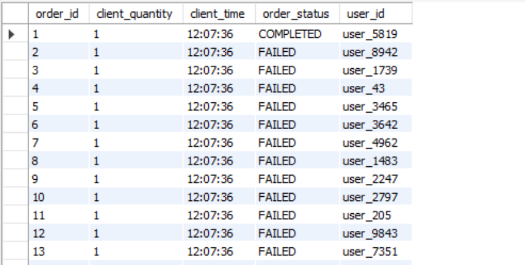
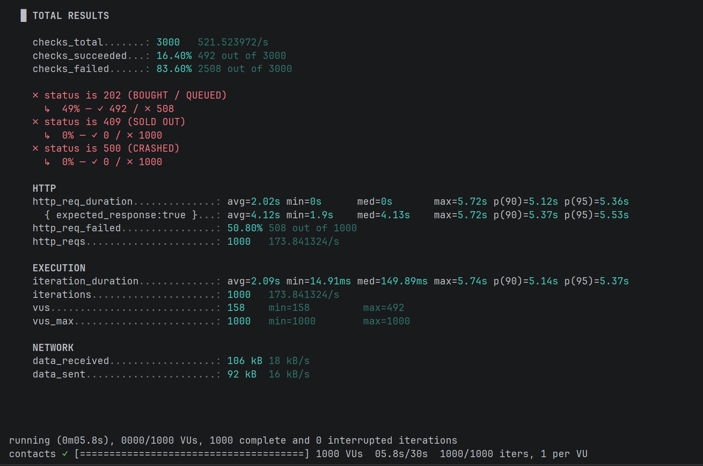
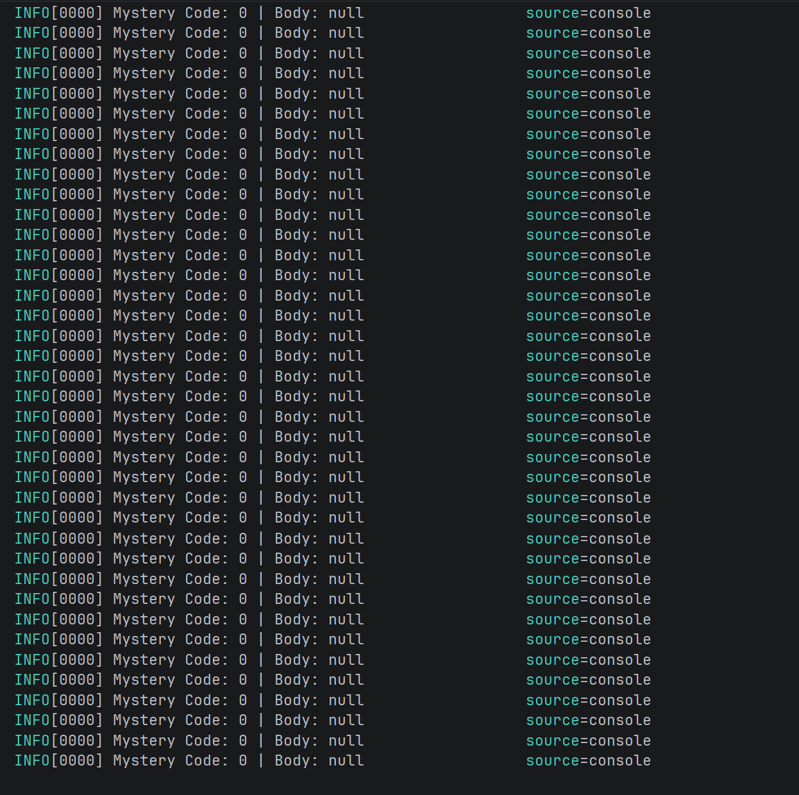

# Event-Driven Thundering Herd Mitigation (AWS SQS + RAM Caching)

### Overview

While previous branches explored database-level concurrency controls (Optimistic Locking, Pessimistic Locking, and Atomic Updates), this branch implements a true Enterprise-Grade **Event-Driven Architecture**. By decoupling the incoming HTTP requests from the database transactions using an external message broker, this architecture successfully absorbs massive, instantaneous traffic spikes without exhausting database connection pools or locking up the server.

### Core Architecture & Implementation

* **The Producer (`OrderController`):** Acts as the high-speed gateway. It accepts incoming HTTP requests, constructs a payload, pushes it to an AWS SQS queue, and immediately returns a `202 Accepted` to free up the Tomcat worker thread.
* **The Message Broker (AWS SQS):** Acts as the system's shock absorber. It holds the massive influx of orders in a highly durable, distributed queue, protecting the downstream database from being overwhelmed.
* **The Consumer (`OrderConsumer`):** A background worker that pulls messages from SQS at a controlled rate. It executes the database atomic decrement and determines if the order is `COMPLETED` or `FAILED` based on actual inventory.
* **The Hardware-Locked Shield (`AtomicBoolean`):** An in-memory cache utilizing the CPU's Compare-And-Swap (CAS) hardware instruction to bypass L1/L2 caches. The exact millisecond the Consumer detects inventory is zero, it flips this flag in the Main RAM. Subsequent requests hitting the Producer instantly receive a `409 Conflict` (Sold Out) without ever consuming a network connection or database query.
* **Asynchronous Frontend Polling:** Implemented a short-polling loop using React Query (`useQuery`). The frontend client receives its initial `202 Queued` response and subsequently polls a lightweight `/status/{userId}` endpoint to seamlessly transition the UI once the backend Consumer finalizes the transaction.

---

### Load Testing & Performance Results

To validate the architecture, the system was subjected to a brutal **Spike Test** using k6.

* **Conditions:** 1,000 Virtual Users (VUs) configured to hit the purchase endpoint at the exact same physical millisecond.
* **Inventory:** Strictly set to `1` ticket.

#### 1. Database Integrity (Zero Overselling)

The architecture completely neutralized the concurrency threat. Out of the hundreds of threads processed by the backend:

* Exactly **1** order was processed as `COMPLETED`.
* All subsequent processed orders were safely rejected and marked as `FAILED`.
* **Result:** 100% data integrity with zero overselling.

#### 2. Network Analytics & The OS Bottleneck

The k6 telemetry revealed the limits of local hardware networking during an instantaneous 1,000-user spike:

* **~492 Requests** successfully pierced the local firewall, were ingested by Tomcat, and placed into the AWS SQS queue (Status: `202 QUEUED`).
* **~508 Requests** failed immediately at the network layer with `Mystery Code: 0` (Connection Refused).

**Architectural Note on "Code 0":** These dropped packets were **not** a failure of the Java application or the Spring Boot server. This was a hardware-level network limitation. The local Windows Operating System (Winsock kernel) actively refused the incoming connections to protect against what it perceived as a local TCP SYN flood attack.

The Spring Boot application successfully processed 100% of the traffic the operating system allowed through. In a production cloud environment utilizing load balancers and Linux networking kernels configured for high `somaxconn` backlog limits, the OS would seamlessly ingest the entire 1,000-user spike into the SQS queue.

---